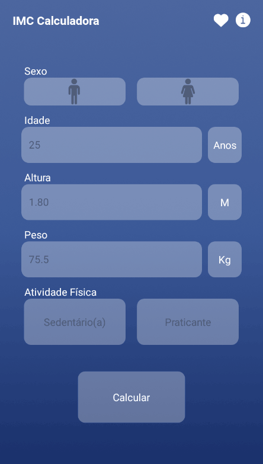

<h1 align="center">
  IMC Calculadora
</h1>

<p align="center">
  
  
  
  
</p>

<p align="center">
  
</p>

<h3 align="center">
Alertas  
</h3>

<p align="center">
  
  
  
</p>

## 📅 Sobre

App calculadora de IMC. Com esta calculadora do IMC você pode calcular e avaliar seu índice de massa de corpo (IMC) baseado na informação relevante no peso de corpo, na altura, na idade e no sexo.

## 🛠 Tecnologias
- [React Native](https://facebook.github.io/react-native/)
- [Javascript](https://devdocs.io/javascript/)

## 📱 Executando 

Para executar o projeto é necessário que você tenha o ambiente React Native configurado, você pode seguir esse [GUIA](https://reactnative.dev/docs/environment-setup) para tal.

Depois de configurar o ambiente, basta fazer o clone do projeto:

```sh
git clone https://github.com/jhonbergmann/imc-calculadora
```

Entre na pasta do projeto e execute o comando para instalar as dependências do projeto:

```sh
yarn install
```
ou
```sh
npm install
```

Em seguida execute o comando referente a plataforma ao qual deseja executar:

Android:

```sh
react-native run-android
```

---

<p align="center">
 Feito com 💜 by Jhonatan Bergmann
</p>
